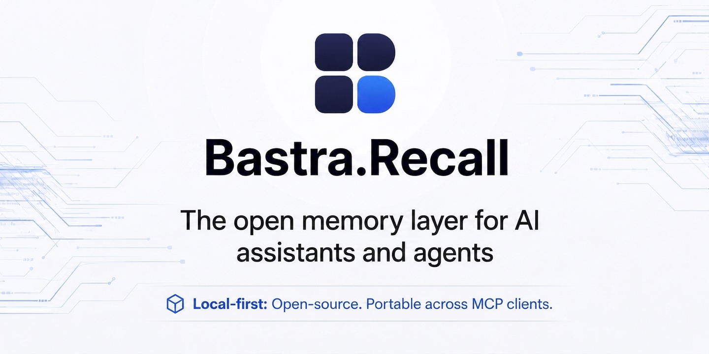

<p align="center">
  
</p>

# Bastra.Recall

> A persistent teammate memory for any AI assistant — across every surface.
> Ein persistentes Teammate-Gedächtnis für jeden AI-Assistenten — über jede Oberfläche hinweg.

[](https://bastra.io)
[](https://discord.gg/5yNaXsRhWB)
[](./LICENSE)
[](https://github.com/n0mad-ai/bastra-recall/stargazers)
[](https://github.com/n0mad-ai/bastra-recall/issues)
[](https://github.com/n0mad-ai/bastra-recall/commits/main)
[](https://www.typescriptlang.org/)
[](https://modelcontextprotocol.io/)
[](https://github.com/sponsors/n0mad-ai)

---

## 🇬🇧 English

**What it is** — A long-term memory for any AI assistant or agent: Claude (Code, Desktop, Web), ChatGPT (via Custom GPT Actions), Cursor, and anything else that speaks MCP or HTTP. Whenever you correct it, state a rule, or commit to a decision, it gets saved as a small note. In your next chat — days or weeks later, in any tool — the AI pulls those notes back automatically. No more repeating yourself. Everything stays on your own Mac as plain Markdown files (Obsidian-compatible). All your AI tools share the same memory at the same time.

**Status** — 🟢 Early beta. M0 (eval) and M1 (read path) done, M2 (save path) functional, and the Claude Code reflex layer ships with hooks for `SessionStart`, `UserPromptSubmit`, `PreToolUse` file edits / todos / bash safety, `PostToolUse` bash act-signals + failure recall, plus optional `Stop` save-eval. Distribution and multi-surface hardening are active. See [PLAN.md](./PLAN.md).

### Why

Working with an AI assistant over months means re-explaining the same things. Pitfalls it already learned in one project recur in the next. Stable preferences (*"give me a recommendation, not a 5-option menu"*) get forgotten between sessions. Project-specific facts get re-discovered every time.

Most AI tools have memory features, but they're **passive**: a static index file at best, no proactive recall, no cross-surface continuity.

The cost isn't just frustration — it's that the user ends up thinking *for* the AI. *"Wait, didn't we solve this last week?"* That's the bug.

### What bastra-recall does

A persistent memory layer that:

- **Saves autonomously** — when a lesson is learned (frustration, repeated correction, durable preference, finalized decision), the AI writes it to the vault without being asked. Trigger discipline ships as a Claude Code Skill; other clients are conditioned through their own system prompt or Custom GPT instructions.
- **Recalls before acting** — not only when the user prompts. The AI is instructed to query the vault before writing code, before plans, and at session start. The highest-weighted search field is `recall_when`, declared at save time.
- **Works across surfaces** — one local daemon serves all your AI tools at once: Claude Code (via MCP), Claude Desktop (via MCP), ChatGPT (via Custom GPT Actions over HTTP), Cursor, and anything else that speaks MCP or HTTP.
- **Plain markdown, Obsidian-compatible** — the vault is a folder of `.md` files with YAML frontmatter. Edit in Obsidian, in the AI, or by hand. Vaults on Google Drive / iCloud / Dropbox mounts are supported via automatic polling-mode in the file watcher.

### The single success metric

> **The user doesn't have to think for the AI anymore.**

If recurring mistakes still recur, if the user still has to re-state preferences each session — the project failed, regardless of how clean the architecture is.

### How it works

```
Vault (configurable, plain markdown + YAML frontmatter, Obsidian-compatible)
          │  chokidar (auto-polls on cloud-storage mounts)
          ▼
bastra-recall daemon (TypeScript / Node 22+, single local process)
  - In-memory BM25 index (MiniSearch) — recall_when×5, title×4, tags×3, doc2query×2
  - Hybrid recall: BM25 + embeddings (Ollama or OpenAI) via RRF fusion
  - doc2query (#117): offline Ollama paraphrases triggers at write time → far
    recall, query path unchanged (off via BASTRA_TRIGGER_EXPAND=0)
  - Tools: recall, load_memory, save_memory, find/read/save_document,
    save_product_doc
  - Save path: validates frontmatter → writes file → force-reindexes
    (so a save and a recall in the same turn are consistent)
  - Transport: stdio MCP + HTTP REST (for non-MCP clients)
          │
          ▼
One daemon ↔ many AI clients
  - Claude Code / Desktop / Cursor → via thin MCP forwarder (stdio → HTTP)
  - ChatGPT Custom GPT, web apps, custom scripts → via REST /api/v1/*
  - All clients share the same vault, index, telemetry stream
```

The Claude Code reflex layer ships with six quiet hooks by default, all
speaking to the daemon's loopback HTTP endpoint:

- **`PreToolUse`** (`bastra-recall-hook`) — fires before every `Write`/`Edit`/`MultiEdit`/`NotebookEdit`. Topic-detects from the tool intent and injects `<recall-hints>` as `additionalContext`.
- **`SessionStart`** (`bastra-recall-session-hook`) — fires on `startup`/`resume`/`clear`/`compact`. Preloads top user-prefs + cross-project rules + project-scoped memories as `<session-context>` so the AI knows who, what, and what-not from the first prompt.
- **`UserPromptSubmit`**, **`TodoWrite`**, **Bash safety**, and **Bash failure** hooks cover lookup prompts, topology recall before plans, destructive-command safety, and command-failure lesson recall.

The **`Stop`** save-eval hook is on by default: since the #48 redesign it is
silent — suggestions go to a file the next session reads, with no chat noise.
Opt out with `bastra install claude-code --no-stop-hook`.
Telemetry (`scripts/stats.ts`) tracks per-hook latency, hint-quality, and
follow-through (did the AI actually `load_memory` after a hint).

Details: [docs/architecture.md](./docs/architecture.md), [docs/memory-schema.md](./docs/memory-schema.md), [docs/triggers.md](./docs/triggers.md).

### Memory shape

Each memory is a markdown file with structured frontmatter:

```yaml
---
id: css-input-focus-ring-stacking
title: "Don't stack focus styles on inputs"
type: lesson
summary: "Stacking ring + outline + custom :focus on nested inputs causes double focus rings. Use single :focus-visible."
topic_path: [css, input, focus]
tags: [css, input, focus-ring, ui-bug]
scope: all-projects
recall_when:
  - creating new input component
  - writing input or form css
  - focus or accessibility styling
related: [css-effects-stacking-antipattern]
source: "carnexus, recurring lesson"
confidence: 0.95
---
```

The `recall_when` field is the bridge between save and recall: when saving, the AI declares the contexts under which future-sessions should be reminded. See [docs/memory-schema.md](./docs/memory-schema.md) for full field semantics and six example memories covering `lesson`, `preference`, `project-fact`, `meta-working`, `decision`, `workflow`.

### Self-learning taxonomy

The vault grows its own structure. When recent memories keep forming the same ad-hoc cluster (people, places, tools, …) without a home, the stop hook suggests recording a **convention** — a memory in the reserved scope `taxonomy` that fixes the cluster's folder, `topic_path` shape and tags. Active conventions are injected at session start and are binding for future saves. `save_memory` takes a `folder` argument so cluster members get a real folder (e.g. `memories/people/`), and re-saving with a changed folder *moves* the file (the old copy lands in the vault trash, recoverable). All of it lives per-vault on the free axes — the `type` schema stays fixed. Details: [docs/taxonomy.md](./docs/taxonomy.md).

### Install

Three paths, in order of friction. bastra-recall is self-contained: the daemon, the MCP server, the REST gateway, the `bastra` CLI, and the Skill all ship in this repo — nothing else needed for full vault functionality.

#### A) One double-click — easiest, for non-coders (rolling out)

1. Download **Install Bastra.command** from the latest GitHub release.
2. Double-click it in Finder.
3. Done. Restart Claude Code / Claude Desktop / Cursor.

The script installs Homebrew if it's missing, adds the bastra tap, installs `bastra-recall`, and hands over to the guided setup (`bastra install`): selection lists for the memory vault, your AI clients, and semantic recall — no terminal knowledge required.

#### B) One command — for developers

Pre-requisites: Node 22+, Git.

```bash
git clone https://github.com/n0mad-ai/bastra-recall.git
cd bastra-recall
npm install
npm run build

node packages/daemon/dist/cli.js install all --vault /abs/path/to/your/vault
node packages/daemon/dist/cli.js doctor
node packages/daemon/dist/cli.js doctor --fix   # repair stale/missing registrations
node packages/daemon/dist/cli.js uninstall all
```

Adapter status:

| Surface | What gets installed | Status |
|---|---|---|
| `claude-desktop` | MCP server entry in `claude_desktop_config.json` + Skill in `.claude/skills/` | ✅ implemented |
| `claude-code` | MCP server in `.claude.json` + Skill in `.claude/skills/` + hooks & powerline statusLine in `.claude/settings.json` | ✅ implemented |
| `cursor` | MCP server entry in `.cursor/mcp.json` | ✅ implemented (Cursor Rules layer is a separate roadmap item) |

Every write is **idempotent** (re-runs are no-ops), **atomic** (tmp file + rename), **backed up** (timestamped `.bak-…` next to the original), and **parse-safe** (broken JSON aborts the run instead of corrupting it). Vault path resolves in this order: `--vault <path>` flag → `BASTRA_VAULT_PATH` env → auto-detect from an existing registration in `~/.claude.json` or `claude_desktop_config.json`. If none of those produce a path (a fresh machine), an interactive `bastra install` offers to create `~/BastraVault` for you; non-interactive runs (piped, `--yes`, `--dry-run`) keep the clear deterministic error.

Once installed through Homebrew or npm, this collapses to a single command. From the first npm release on:

```bash
npx bastra-recall install           # zero-install: guided setup with selection lists
npx bastra-recall install all       # direct: all clients (script-friendly, add --yes for CI)
# or install the CLI globally:
npm install -g bastra-recall
bastra install
```

#### C) Fully manual — fallback

Add the MCP server block to your client's config (`~/.claude.json` for Claude Code, `~/Library/Application Support/Claude/claude_desktop_config.json` for Claude Desktop, `~/.cursor/mcp.json` for Cursor).

**Recommended (forwarder mode — shares one daemon across all sessions):**

```json
"bastra-recall": {
  "command": "node",
  "args": ["/abs/path/to/bastra-recall/packages/daemon/dist/mcp-forwarder.js"],
  "env": {
    "BASTRA_VAULT_PATH": "/abs/path/to/your/vault"
  }
}
```

The forwarder is a thin stdio-MCP wrapper that talks to a single local HTTP daemon (port 6723 by default). All MCP clients — Claude Code, Claude Desktop, Cursor, additional sessions — share the same vault state, embedding index, and telemetry. The forwarder auto-spawns the daemon on first run if no one is listening yet.

**Standalone mode (one MCP client only, no sharing):**

```json
"bastra-recall": {
  "command": "node",
  "args": ["/abs/path/to/bastra-recall/packages/daemon/dist/index.js"],
  "env": {
    "BASTRA_VAULT_PATH": "/abs/path/to/your/vault"
  }
}
```

For Claude Code, also drop the Skill + hooks by hand:

```bash
bash packages/skill/install.sh        # copies SKILL.md → ~/.claude/skills/bastra-recall/
bash packages/skill/install-hook.sh   # registers all 7 reflex-layer hooks (opt out of the Stop save-eval with --no-stop-hook)
```

`bastra install claude-code` does both of these for you in path B. Re-run `install.sh` whenever `SKILL.md` changes; re-run `install-hook.sh` only if hook binary paths move. To remove the hooks again: `bash packages/skill/install-hook.sh --uninstall`.

### Semantic recall (optional)

Recall is hybrid: BM25 keyword search is the always-on default, and a semantic layer — an optional, configurable second pass — kicks in once an embedding provider is set up. Enabling it is one command:

```bash
bastra embeddings on       # installs Ollama via Homebrew (if missing), pulls embeddinggemma (~620 MB), persists the choice
bastra embeddings status   # effective provider + how it was resolved (env / cli-settings / default) + model presence
bastra embeddings off      # back to BM25 keyword-only
```

At the end of a successful `bastra install`, bastra asks once whether to enable semantic recall (interactive terminals only — never with `--yes` or `--dry-run`, and never in scripts; those print the `bastra embeddings on` hint instead of hanging). `--ollama` sets it up without asking, `--no-ollama` skips. The Ollama login service is a toggle (`bastra config set ollama.autostart off`); the daemon also re-starts a stopped local Ollama on boot (probe-first, loopback only, honours the same toggle). Without an embedding provider, recall stays on BM25 — nothing breaks. `bastra status` shows the active mode, and `bastra doctor` says explicitly when semantic recall is off or the model is missing.

Manual (no Homebrew): install + start [Ollama](https://ollama.com), `ollama pull embeddinggemma`, then `bastra embeddings on`. Note: `--yes` does **not** trigger the Ollama download (use `--ollama`). Homebrew and the model come from third parties (Homebrew core, ollama.com). Full details: **[System Requirements](https://github.com/n0mad-ai/bastra-recall/wiki/System-Requirements)** (wiki).

### Bastra Commons (beta)

`bastra commons enable` adds a second, read-only recall source: [Bastra Commons](https://github.com/n0mad-ai/bastra-commons), a community vault of **verified engineering recipes** — solutions with their failed paths, proven by use, where best-practice status is *earned through independent verification records, never declared*. Commons hits surface in `recall` with `scope: commons`, ranked just below your personal memories; the clone is git-synced (`bastra commons update`) and the daemon never writes into it. (The Commons repository opens to the public with its launch — see the [wiki page](../../wiki/Bastra-Commons) for the model.)

### Product docs (optional)

Beyond memories, the vault can keep **living product documentation** per project — user-facing docs ("how do I use this?") in `dokumentationen/<project>/`, one markdown file per feature area, updated in place via the `save_product_doc` tool. Off by default; enable with:

```bash
bastra config set docs.mode suggest   # agent proposes a doc update when a feature area is finished
bastra config set docs.mode auto      # agent updates the doc autonomously
bastra config set docs.language de    # language the docs are written in (default: en)
```

With `docs.mode` set, the session hook injects the capture instruction: when a user-facing feature area is **completely finished** (works end-to-end, commit landed), the agent creates or refreshes that area's doc — written for the end user, no code internals. Developer-facing state (file maps, architecture) stays in `project-fact` memories. Docs are searchable via `find_document`; in the default `recall` they rank deliberately below memories so long doc bodies never crowd out lessons. Full details: **[Product Docs](https://github.com/n0mad-ai/bastra-recall/wiki/Product-Docs)** (wiki).

### Vault map (optional)

`bastra map` opens an interactive, local-only map of your vault in the browser (`http://127.0.0.1:6723/ui`). Three views: **Clouds** (force layout along your folder structure), **Ring** (a drill-down wheel over the memory building blocks — projects, people, self, knowledge, rules, artifacts), and **Semantic** (arranged by embedding meaning, with dashed strands for *connections you never wrote*). The search combines instant matches, hybrid recall, and a local **search copilot** you can chat with to deepen a search — grounded in your notes, powered by the same local Ollama model as doc2query, nothing leaves the machine. Care flags mark memories for a cleanup session right from the map. Off by default; `bastra map` offers to enable it (`ui.enabled`).

Full details: **[Vault Map](https://github.com/n0mad-ai/bastra-recall/wiki/Vault-Map)** (wiki).

### Vault care — flag it now, groom it later

Memories age: titles go stale, duplicates creep in, ghosts point at notes you never wrote. bastra-recall turns tending the vault into a two-step loop instead of a chore. From any node's inspector on the vault map you flag a memory — *delete*, *edit*, *write* (for ghosts), or *note* — and the flags land as checkbox lines in an open `vault-care.md` at the vault root. Your **next AI session sees the open flags automatically** (session hook) and offers to work the list off with you: one guided cleanup pass, your call on every item. No hidden state, no separate app — a markdown checklist any editor can open.

### Importing memories — skip the cold start

Your other AI tools already know you — `bastra import` brings that head start along instead of starting cold. Three paths, one gate: candidates land as checkbox lines in `import-review.md` at the vault root, and your **next AI session distills accepted ones with you** — proper type, concrete triggers, deduped against what the vault already holds. Nothing is saved without your accept.

```bash
bastra import memories.txt         # a memory list: ChatGPT / Claude / Gemini export, free text — or paste via `bastra import -`
bastra import conversations.json   # a full data export (ChatGPT / Claude) — queued for chunk-wise mining
bastra import rules                # local rules files: CLAUDE.md, AGENTS.md, .cursorrules, .cursor/rules/, ~/.claude/CLAUDE.md
```

A `conversations.json` never stages raw chat history: only **your own messages** are kept (assistant turns dropped), queued locally under `~/.bastra/` — it never leaves the machine, is deleted when mining completes, and `bastra import clear` discards it anytime. Your AI session combs the queue chunk-wise (`bastra import mine`) and stages candidate lessons, decisions and preferences for your review. The vault map carries a visual import dialog (topbar ↓) for the paste path.

### Feedback

`bastra feedback bug` / `bastra feedback idea` opens a prefilled GitHub issue form in your browser. The bug form carries a sanitized diagnostics block — version, OS, Node, embedding mode, vault size; never file paths, never vault content — and you review and submit it yourself. The vault map links both forms in its sidebar.

### Updating

`bastra update` pulls the latest release (npm or Homebrew), re-registers every surface, and restarts the daemon. Opt into hands-off updates with `bastra config set update.mode auto` — bastra then stages a new version at session start without disrupting a running session. Running `bastra` with no arguments shows version, update status, daemon health, and vault size.

Full details: **[Updating & settings](https://github.com/n0mad-ai/bastra-recall/wiki/Updating)** (wiki).

### REST API (for non-MCP clients)

The daemon exposes a REST API on `http://127.0.0.1:6723/api/v1/` covering every tool the MCP server offers. This is the integration point for clients that can't speak stdio-MCP — most notably **ChatGPT Custom GPT Actions**, which call HTTPS endpoints with an OpenAPI schema.

Endpoints (all `POST`, JSON body):

| Endpoint | Tool |
|---|---|
| `/api/v1/recall` | recall |
| `/api/v1/load_memory` | load_memory |
| `/api/v1/save_memory` | save_memory |
| `/api/v1/find_document` / `read_document` / `open_document` | document search |
| `/api/v1/save_document` / `recategorize_document` / `move_document` | document write (Pro) |
| `/api/v1/save_product_doc` | product docs |

In addition, `GET`/`POST /settings/docs` reads/writes the product-docs settings (`{mode, language}`) — loopback-only like `/hook/*`, intended for local UIs such as the Bastra Mac app's options pane.

Auth and CORS:

- **Token:** `bastra token` prints the daemon's API token, minting one on first use (`bastra token rotate` issues a fresh one; `bastra token clear` removes it, locking out browser/REST clients). It's stored in `cli-settings.json`; the daemon reads it at startup, so restart after issuing, rotating, or clearing. `bastra` (the status panel) and `bastra status` show whether a token is set, without printing it. `BASTRA_API_TOKEN` overrides it.
- **Local tools** (CLI, MCP-forwarder — no `Origin` header) reach `/api/v1/*` over loopback without a token. Set `BASTRA_AUTH_LOOPBACK_SKIP=0` to require the token even for them.
- **Browser clients** (any request *with* an `Origin` header) must always present the token **and** be on the CORS allowlist — even over loopback, since the user's browser shares `127.0.0.1` with the daemon and only the `Origin` header tells a real site from a stray one.
- **CORS** is deny-by-default: with `BASTRA_CORS_ORIGIN` unset, **no** browser origin is allowed. For a hosted web app, set an allowlist: `BASTRA_CORS_ORIGIN=https://your.host` (comma-separated for several) — the daemon then reflects only listed origins and a browser blocks the rest. `BASTRA_CORS_ORIGIN=*` remains available as an explicit tunnel/dev opt-in (the daemon logs a warning when combined with a minted token).
- **DNS rebinding** is blocked: the token-less loopback endpoints (`/health`, `/hook/*`, `/vault/count`) only answer requests whose `Host` header is loopback (`127.0.0.1` / `localhost` / `[::1]`). `/api/v1/*` is unaffected (the token protects it). Tunnel setups that need more than `/api/v1/*` can allowlist hosts via `BASTRA_ALLOWED_HOSTS` (comma-separated).

To reach this daemon from a hosted web app (e.g. a site's admin talking to the user's *local* vault from the browser), set `BASTRA_CORS_ORIGIN` to the site origin, run `bastra token`, and paste the token into the site. When that site is served over **HTTPS** (e.g. `https://bastra.io`), Chrome sends a **Private Network Access** preflight for the public-origin → localhost call; the daemon answers it automatically with `Access-Control-Allow-Private-Network: true` for allowed origins — no extra config. For a server-side client like ChatGPT, point a tunnel (Cloudflare Tunnel / ngrok / your own reverse proxy) at `127.0.0.1:6723` and configure it with the tunnel URL + your token. An OpenAPI 3.0 starter spec lives in [docs/openapi.yaml](./docs/openapi.yaml).

> **Status:** the ChatGPT Custom GPT Actions path does **not work end-to-end yet**. The REST API and the OpenAPI spec are in place, but the Custom GPT integration is still being worked out — see the roadmap below.

### Roadmap

Milestone-based, not phase-based. Each gate is a hard pass/fail.

| Milestone | Scope | Status |
|---|---|---|
| **M0** | Recall-quality eval on real vault | ✅ **Done** — Recall@1 98.3%, Recall@3 100%, MRR 0.992 across 59 memories (own-trigger baseline). BM25 + `recall_when`-boost is sufficient; embeddings deferred. |
| **M1** | Daemon + read path (`recall`, `load_memory`) | ✅ **Done** — MCP server live, watcher works on cloud-storage mounts. |
| **M2** | Save path + autonomous-save triggers | 🟡 **Functional** — `save_memory` MCP tool live with force-reindex. Trigger discipline shipped as a Skill. False-save / missed-save metrics not yet collected. |
| **M0.5** | Stress-test recall (paraphrased / cross-memory / anti-hallucination) | ⏳ Open — see issues. |
| **M3** | Reflex layer: hooks for `SessionStart` / `UserPromptSubmit` / `PreToolUse` / `PostToolUse` plus `Stop` | 🟡 **Functional** — seven quiet Claude Code hooks are installed by default; the `Stop` save-eval can be opted out with `--no-stop-hook`. |
| **Distribution** | Homebrew tap, `bastra` CLI, `Install Bastra.command`, npm package | 🟢 **npm live** — published to npm: `npx bastra-recall install all` / `npm i -g bastra-recall` work today; releases auto-publish on GitHub Release via OIDC trusted publishing. `bastra` CLI ships adapters for every surface. Homebrew tap `n0mad-ai/tap` is live (formula tracks the latest release) and the `.command` asset ships with each GitHub release. |
| **Multi-surface** | One install per AI client (MCP + Skill + Hooks where applicable) + REST gateway for non-MCP clients | 🟡 **Functional** — `bastra install` covers Claude Code (MCP + Skill + Hooks), Claude Desktop (MCP + Skill), Cursor (MCP). REST `/api/v1/*` exposes every tool over HTTPS + tunnel for non-MCP clients. Open: ChatGPT Custom GPT Actions (not working end-to-end yet), Claude.ai web Custom Connector registration (#7). |

Out of v0: **multi-device sync**. See [PLAN.md](./PLAN.md).

Multi-device today works via the OS-level sync of the vault folder (iCloud / Google Drive / Dropbox / Git) — the file watcher's polling mode handles the latency. A browser-based UI is not planned — Obsidian already provides a great Markdown editor for the vault.

### Bastra Mac App

A native macOS app is being built on top of bastra-recall — same vault, same daemon, just a graphical interface for people who don't want to live in the terminal. In development; a dedicated page with screenshots and updates will follow.

### License

MIT — see [LICENSE](./LICENSE).

Public docs and code on this branch are published under the open license; private notes (in `private/`, gitignored) are not.

The statusline (`packages/statusline/`) bundles [owloops/claude-powerline](https://github.com/owloops/claude-powerline) (MIT, © 2025 Owloops) as its rendering engine, with the bastra-status segment built in; the upstream license is retained in [`packages/statusline/LICENSE`](./packages/statusline/LICENSE).

### Status & contact

Early beta. See [PLAN.md](./PLAN.md). Issues and discussions welcome — early feedback shapes the design. Please report security issues privately via [SECURITY.md](./SECURITY.md).

Built by [@n0mad-ai](https://github.com/n0mad-ai).

---

## 🇩🇪 Deutsch

**Was es ist** — Ein Langzeit-Gedächtnis für jeden AI-Assistenten oder Agent: Claude (Code, Desktop, Web), ChatGPT (via Custom GPT Actions), Cursor und alles andere, was MCP oder HTTP spricht. Sobald du etwas korrigierst, eine Regel aufstellst oder eine Entscheidung triffst, wird das als kleine Notiz gespeichert. In der nächsten Sitzung — Tage oder Wochen später, in jedem Tool — holt die AI diese Notizen automatisch wieder hervor. Schluss mit ewigem Wiederholen. Alles bleibt lokal auf deinem Mac als reine Markdown-Dateien (Obsidian-kompatibel). Alle deine AI-Tools teilen sich dasselbe Gedächtnis gleichzeitig.

**Status** — 🟢 Frühe Beta. M0 (Eval) und M1 (Read-Path) fertig, M2 (Save-Path) funktional, und der Claude-Code-Reflex-Layer liefert Hooks für `SessionStart`, `UserPromptSubmit`, `PreToolUse` (Datei-Edits / Todos / Bash-Safety), `PostToolUse` (Bash Act-Signal + Fehler-Recall) plus optionalen `Stop` Save-Eval. Distribution und Multi-Surface-Hardening laufen. Siehe [PLAN.md](./PLAN.md).

### Warum

Wenn du Monate mit einem AI-Assistenten arbeitest, erklärst du dieselben Dinge immer wieder. Stolperfallen, die er in einem Projekt schon mal gelernt hat, kommen im nächsten zurück. Stabile Vorlieben (*"gib mir eine Empfehlung, kein 5-Optionen-Menü"*) sind zwischen Sitzungen vergessen. Projekt-spezifische Fakten werden jedes Mal neu entdeckt.

Die meisten AI-Tools haben zwar Memory-Features, aber die sind **passiv**: bestenfalls eine statische Index-Datei, kein proaktives Erinnern, keine Kontinuität über verschiedene Oberflächen hinweg.

Der Preis ist nicht nur Frust — sondern dass am Ende der User für die AI mitdenkt. *"Moment, das hatten wir doch letzte Woche schon gelöst?"* Genau das ist der Bug.

### Was bastra-recall macht

Eine persistente Gedächtnis-Schicht, die:

- **Autonom speichert** — wenn etwas gelernt wird (Frust, wiederholte Korrektur, dauerhafte Vorliebe, finale Entscheidung), schreibt die AI das ungefragt in den Vault. Die Trigger-Disziplin wird als Claude Code Skill ausgeliefert; andere Clients werden über ihren System-Prompt oder Custom-GPT-Instructions konditioniert.
- **Vor dem Handeln erinnert** — nicht erst auf User-Anfrage. Die AI wird angewiesen, den Vault vor dem Code-Schreiben, vor Plänen und beim Sitzungsstart abzufragen. Das höchstgewichtete Suchfeld ist `recall_when`, das beim Speichern deklariert wird.
- **Über alle Oberflächen hinweg funktioniert** — ein lokaler Daemon bedient alle deine AI-Tools gleichzeitig: Claude Code (via MCP), Claude Desktop (via MCP), ChatGPT (via Custom GPT Actions über HTTP), Cursor und alles weitere, was MCP oder HTTP spricht.
- **Reines Markdown, Obsidian-kompatibel** — der Vault ist ein Ordner mit `.md`-Dateien und YAML-Frontmatter. Bearbeitbar in Obsidian, durch die AI oder per Hand. Vaults auf Google Drive / iCloud / Dropbox werden über den automatischen Polling-Modus des File-Watchers unterstützt.

### Der einzige Erfolgs-Maßstab

> **Der User muss nicht mehr für die AI mitdenken.**

Wenn wiederkehrende Fehler weiter auftreten, wenn der User in jeder Sitzung dieselben Vorlieben wiederholen muss — dann ist das Projekt gescheitert, egal wie sauber die Architektur ist.

### Wie es funktioniert

```
Vault (konfigurierbar, reines Markdown + YAML-Frontmatter, Obsidian-kompatibel)
          │  chokidar (Auto-Polling auf Cloud-Storage-Mounts)
          ▼
bastra-recall Daemon (TypeScript / Node 22+, ein lokaler Prozess)
  - In-Memory BM25-Index (MiniSearch) — recall_when×5, title×4, tags×3, doc2query×2
  - Hybrid Recall: BM25 + Embeddings (Ollama oder OpenAI) via RRF-Fusion
  - doc2query (#117): offline Ollama paraphrasiert Trigger zur Schreibzeit → far
    Recall, Query-Pfad unverändert (aus via BASTRA_TRIGGER_EXPAND=0)
  - Tools: recall, load_memory, save_memory, find/read/save_document,
    save_product_doc
  - Save-Path: validiert Frontmatter → schreibt Datei → erzwingt Reindex
    (sodass save und recall im selben Turn konsistent sind)
  - Transport: stdio-MCP + HTTP-REST (für Nicht-MCP-Clients)
          │
          ▼
Ein Daemon ↔ viele AI-Clients
  - Claude Code / Desktop / Cursor → über dünnen MCP-Forwarder (stdio → HTTP)
  - ChatGPT Custom GPT, Web-Apps, eigene Skripte → über REST /api/v1/*
  - Alle Clients teilen denselben Vault, Index und Telemetry-Stream
```

Der Claude-Code-Reflex-Layer installiert standardmäßig sechs ruhige Hooks, die
den lokalen HTTP-Endpoint des Daemons nutzen:

- **`PreToolUse`** (`bastra-recall-hook`) — feuert vor jedem `Write`/`Edit`/`MultiEdit`/`NotebookEdit`. Erkennt das Thema aus dem Tool-Aufruf und injiziert `<recall-hints>` als `additionalContext`.
- **`SessionStart`** (`bastra-recall-session-hook`) — feuert bei `startup`/`resume`/`clear`/`compact`. Lädt Top-User-Präferenzen + projektübergreifende Regeln + projekt-spezifische Memories als `<session-context>` vor, damit die AI ab dem ersten Prompt weiß: wer, was, und was-nicht.
- **`UserPromptSubmit`**, **`TodoWrite`**, **Bash-Safety** und **Bash-Failure** decken Lookup-Prompts, Topology-Recall vor Plänen, Safety bei riskanten Shell-Befehlen und Lesson-Recall bei fehlgeschlagenen Commands ab.

Der **`Stop`** Save-Eval-Hook ist standardmäßig an: seit dem #48-Redesign ist er
still — Vorschläge landen in einer Datei, die die nächste Session liest, ohne
Chat-Rauschen. Abwählen mit `bastra install claude-code --no-stop-hook`. Die Telemetrie (`scripts/stats.ts`)
misst pro Hook Latenz, Hint-Qualität und Follow-Through (hat die AI nach einem
Hint wirklich `load_memory` gemacht).

Details: [docs/architecture.md](./docs/architecture.md), [docs/memory-schema.md](./docs/memory-schema.md), [docs/triggers.md](./docs/triggers.md).

### Aufbau einer Memory

Jede Memory ist eine Markdown-Datei mit strukturiertem Frontmatter:

```yaml
---
id: css-input-focus-ring-stacking
title: "Don't stack focus styles on inputs"
type: lesson
summary: "Stacking ring + outline + custom :focus on nested inputs causes double focus rings. Use single :focus-visible."
topic_path: [css, input, focus]
tags: [css, input, focus-ring, ui-bug]
scope: all-projects
recall_when:
  - creating new input component
  - writing input or form css
  - focus or accessibility styling
related: [css-effects-stacking-antipattern]
source: "carnexus, recurring lesson"
confidence: 0.95
---
```

Das `recall_when`-Feld ist die Brücke zwischen Save und Recall: beim Speichern deklariert die AI die Kontexte, in denen die spätere Sitzung daran erinnert werden soll. Siehe [docs/memory-schema.md](./docs/memory-schema.md) für die vollständige Feld-Semantik und sechs Beispiel-Memories für `lesson`, `preference`, `project-fact`, `meta-working`, `decision`, `workflow`.

### Selbstlernende Taxonomie

Der Vault baut sich seine Struktur selbst. Wenn jüngste Memories wiederholt dasselbe Ad-hoc-Cluster bilden (Personen, Orte, Tools, …), ohne dass es eine Heimat hat, schlägt der Stop-Hook vor, eine **Konvention** festzuhalten — ein Memory im reservierten Scope `taxonomy`, das Ordner, `topic_path`-Form und Tags des Clusters festlegt. Aktive Konventionen werden bei Session-Start injiziert und sind für künftige Saves bindend. `save_memory` nimmt ein `folder`-Argument, damit Cluster-Mitglieder einen echten Ordner bekommen (z.B. `memories/people/`); ein erneutes Speichern mit geändertem Ordner *verschiebt* die Datei (die alte Kopie landet recoverbar im Vault-Trash). Alles lebt pro Vault auf den freien Achsen — das `type`-Schema bleibt fix. Details: [docs/taxonomy.md](./docs/taxonomy.md).

### Installation

Drei Wege, nach Aufwand sortiert. bastra-recall ist eigenständig: Daemon, MCP-Server, REST-Gateway, `bastra`-CLI und Skill liegen alle in diesem Repo — mehr braucht es nicht für die volle Vault-Funktionalität.

#### A) Ein Doppelklick — am einfachsten, für Nicht-Coder (Rollout läuft)

1. Lade **Install Bastra.command** aus dem aktuellen GitHub-Release.
2. Doppelklick im Finder.
3. Fertig. Claude Code / Claude Desktop / Cursor neu starten.

Das Skript installiert bei Bedarf Homebrew, fügt den bastra-Tap hinzu, installiert `bastra-recall` und startet das geführte Setup (`bastra install`): Auswahllisten für Memory-Vault, AI-Clients und Semantic Recall — kein Terminal-Wissen nötig.

> **Status:** Tap `n0mad-ai/tap` ist live; das `.command`-Asset hängt an jedem GitHub-Release.

#### B) Ein Befehl — für Entwickler

Voraussetzungen: Node 22+, Git.

```bash
git clone https://github.com/n0mad-ai/bastra-recall.git
cd bastra-recall
npm install
npm run build

node packages/daemon/dist/cli.js install all --vault /abs/pfad/zu/deinem/vault
node packages/daemon/dist/cli.js doctor
node packages/daemon/dist/cli.js doctor --fix   # veraltete/fehlende Registrierungen reparieren
node packages/daemon/dist/cli.js uninstall all
```

Adapter-Status:

| Surface | Was installiert wird | Status |
|---|---|---|
| `claude-desktop` | MCP-Server-Eintrag in `claude_desktop_config.json` + Skill in `.claude/skills/` | ✅ implementiert |
| `claude-code` | MCP-Server in `.claude.json` + Skill in `.claude/skills/` + Hooks & Powerline-statusLine in `.claude/settings.json` | ✅ implementiert |
| `cursor` | MCP-Server-Eintrag in `.cursor/mcp.json` | ✅ implementiert (Cursor-Rules-Layer separater Roadmap-Punkt) |

Jeder Write ist **idempotent** (Re-Runs sind No-Ops), **atomar** (Tmp-File + Rename), **gesichert** (timestamped `.bak-…` neben dem Original) und **parse-safe** (kaputtes JSON bricht den Lauf ab statt es zu zerstören). Vault-Pfad-Auflösung in dieser Reihenfolge: `--vault <pfad>`-Flag → `BASTRA_VAULT_PATH`-ENV → Auto-Detect aus bestehender Registrierung in `~/.claude.json` oder `claude_desktop_config.json`. Greift nichts davon (frische Maschine), bietet ein interaktives `bastra install` an, `~/BastraVault` anzulegen; nicht-interaktive Läufe (gepiped, `--yes`, `--dry-run`) behalten die klare, deterministische Fehlermeldung.

Sobald über Homebrew oder npm installiert, verkürzt sich das zu einem einzigen Befehl. Ab dem ersten npm-Release:

```bash
npx bastra-recall install           # ohne Installation: geführtes Setup mit Auswahllisten
npx bastra-recall install all       # direkt: alle Clients (skript-tauglich, --yes für CI)
# oder die CLI global installieren:
npm install -g bastra-recall
bastra install
```

#### C) Komplett manuell — Fallback

MCP-Server-Block in die Client-Config eintragen (für Claude Code: `~/.claude.json`, für Claude Desktop: `~/Library/Application Support/Claude/claude_desktop_config.json`, für Cursor: `~/.cursor/mcp.json`).

**Empfohlen (Forwarder-Modus — ein Daemon für alle Sitzungen):**

```json
"bastra-recall": {
  "command": "node",
  "args": ["/abs/path/to/bastra-recall/packages/daemon/dist/mcp-forwarder.js"],
  "env": {
    "BASTRA_VAULT_PATH": "/abs/path/to/your/vault"
  }
}
```

Der Forwarder ist ein dünner stdio-MCP-Wrapper, der mit einem einzigen lokalen HTTP-Daemon spricht (Standard-Port 6723). Alle MCP-Clients — Claude Code, Claude Desktop, Cursor, weitere Sitzungen — teilen sich denselben Vault-State, Embedding-Index und Telemetry-Stream. Der Forwarder spawnt den Daemon beim ersten Start automatisch, falls noch keiner läuft.

**Standalone-Modus (nur ein MCP-Client, kein Sharing):**

```json
"bastra-recall": {
  "command": "node",
  "args": ["/abs/path/to/bastra-recall/packages/daemon/dist/index.js"],
  "env": {
    "BASTRA_VAULT_PATH": "/abs/path/to/your/vault"
  }
}
```

Für Claude Code zusätzlich Skill + Hooks manuell ablegen:

```bash
bash packages/skill/install.sh        # kopiert SKILL.md → ~/.claude/skills/bastra-recall/
bash packages/skill/install-hook.sh   # registriert alle 7 Reflex-Layer-Hooks (Stop-Save-Eval abwählen mit --no-stop-hook)
```

`bastra install claude-code` aus Pfad B erledigt beides für dich. `install.sh` neu ausführen, wenn sich `SKILL.md` ändert; `install-hook.sh` nur, wenn sich Hook-Binärpfade verschieben. Hooks wieder entfernen: `bash packages/skill/install-hook.sh --uninstall`.

### Semantischer Recall (optional)

Recall ist hybrid: BM25-Stichwortsuche ist der immer aktive Default, eine semantische Schicht — ein optionaler, konfigurierbarer zweiter Pass — kommt dazu, sobald ein Embedding-Provider eingerichtet ist. Einschalten ist ein Befehl:

```bash
bastra embeddings on       # installiert Ollama via Homebrew (falls nötig), zieht embeddinggemma (~620 MB), persistiert die Wahl
bastra embeddings status   # effektiver Provider + Auflösungsweg (env / cli-settings / Default) + Modell-Präsenz
bastra embeddings off      # zurück zu reiner BM25-Stichwortsuche
```

Am Ende eines erfolgreichen `bastra install` fragt bastra einmal, ob semantischer Recall aktiviert werden soll (nur in interaktiven Terminals — nie mit `--yes` oder `--dry-run` und nie in Skripten; dort erscheint statt einer hängenden Abfrage der Hinweis auf `bastra embeddings on`). `--ollama` richtet ohne Nachfrage ein, `--no-ollama` überspringt. Der Ollama-Login-Service ist abschaltbar (`bastra config set ollama.autostart off`); der Daemon startet ein gestopptes lokales Ollama beim Boot auch selbst neu (probe-first, nur Loopback, respektiert denselben Toggle). Ohne Embedding-Provider bleibt Recall bei BM25 — nichts bricht. `bastra status` zeigt den aktiven Modus, und `bastra doctor` sagt explizit, wenn semantischer Recall aus ist oder das Modell fehlt.

Manuell (ohne Homebrew): [Ollama](https://ollama.com) installieren + starten, `ollama pull embeddinggemma`, dann `bastra embeddings on`. Hinweis: `--yes` löst den Ollama-Download **nicht** aus (dafür `--ollama`). Homebrew und das Modell kommen von Dritten (Homebrew Core, ollama.com). Details: **[System Requirements](https://github.com/n0mad-ai/bastra-recall/wiki/System-Requirements)** (Wiki).

### Bastra Commons (Beta)

`bastra commons enable` fügt eine zweite, schreibgeschützte Recall-Quelle hinzu: [Bastra Commons](https://github.com/n0mad-ai/bastra-commons), ein Community-Vault **verifizierter Engineering-Rezepte** — Lösungen samt ihrer Irrwege, durch Anwendung bewiesen. Best-Practice-Status wird dort *durch unabhängige Verifikations-Records verdient, nie erklärt*. Commons-Treffer erscheinen in `recall` mit `scope: commons`, leicht unter den persönlichen Memories gerankt; der Clone wird per git aktualisiert (`bastra commons update`), der Daemon schreibt nie hinein. (Das Commons-Repository wird mit seinem Launch öffentlich — Modell siehe [Wiki-Seite](../../wiki/Bastra-Commons).)

### Produkt-Doku (optional)

Neben Memories kann der Vault **lebende Produkt-Dokumentation** pro Projekt führen — User-facing Doku („wie benutze ich das?") in `dokumentationen/<projekt>/`, eine Markdown-Datei pro Feature-Bereich, in-place aktualisiert über das Tool `save_product_doc`. Standardmäßig aus; einschalten mit:

```bash
bastra config set docs.mode suggest   # Agent schlägt das Doku-Update vor, wenn ein Bereich fertig ist
bastra config set docs.mode auto      # Agent aktualisiert die Doku selbstständig
bastra config set docs.language de    # Sprache der Doku (Default: en)
```

Mit gesetztem `docs.mode` injiziert der Session-Hook die Capture-Anweisung: Wenn ein User-facing Feature-Bereich **komplett fertig** ist (läuft end-to-end, Commit gelandet), legt der Agent die Doku des Bereichs an bzw. frischt sie auf — geschrieben für den Endnutzer, keine Code-Interna. Entwickler-Stand (File-Maps, Architektur) bleibt in `project-fact`-Memories. Doku ist über `find_document` suchbar; im Default-`recall` rankt sie bewusst unter den Memories, damit lange Doku-Bodies keine Lessons verdrängen. Details: **[Product Docs](https://github.com/n0mad-ai/bastra-recall/wiki/Product-Docs)** (Wiki).

### Vault-Map (optional)

`bastra map` öffnet eine interaktive, rein lokale Karte deines Vaults im Browser (`http://127.0.0.1:6723/ui`). Drei Ansichten: **Clouds** (Force-Layout entlang deiner Ordnerstruktur), **Ring** (ein Drill-Down-Rad über die Gedächtnis-Grundbausteine — Projekte, Personen, Selbst, Wissen, Regeln, Artefakte) und **Semantic** (angeordnet nach Embedding-Bedeutung, mit gestrichelten Strängen für *Verbindungen, die du nie geschrieben hast*). Die Suche kombiniert Sofort-Treffer, Hybrid-Recall und einen lokalen **Search-Copiloten**, mit dem du chattend tiefer suchen kannst — gegroundet auf deinen Notizen, angetrieben vom selben lokalen Ollama-Modell wie doc2query, nichts verlässt die Maschine. Care-Flags markieren Memories direkt aus der Karte für eine Pflege-Session. Standardmäßig aus; `bastra map` bietet das Aktivieren an (`ui.enabled`).

Details: **[Vault Map](https://github.com/n0mad-ai/bastra-recall/wiki/Vault-Map)** (Wiki).

### Vault-Pflege — jetzt markieren, später aufräumen

Memories altern: Titel veralten, Dubletten schleichen sich ein, Ghosts zeigen auf nie geschriebene Notizen. bastra-recall macht aus der Vault-Pflege einen Zwei-Schritt-Loop statt einer lästigen Pflicht. Aus dem Inspector jeder Node auf der Vault-Map markierst du ein Memory — *delete*, *edit*, *write* (für Ghosts) oder *note* — und die Flags landen als Checkbox-Zeilen in einer offenen `vault-care.md` im Vault-Root. Deine **nächste AI-Session sieht die offenen Flags automatisch** (Session-Hook) und bietet an, die Liste gemeinsam abzuarbeiten: ein geführter Aufräum-Durchgang, jede Entscheidung bleibt bei dir. Kein versteckter State, keine Extra-App — eine Markdown-Checkliste, die jeder Editor öffnen kann.

### Memories importieren — den Kaltstart überspringen

Deine anderen AI-Tools kennen dich schon — `bastra import` nimmt diesen Vorsprung mit, statt bei null anzufangen. Drei Wege, ein Gate: Kandidaten landen als Checkbox-Zeilen in `import-review.md` im Vault-Root, und deine **nächste AI-Session destilliert akzeptierte gemeinsam mit dir** — richtiger Typ, konkrete Trigger, dedupliziert gegen den Bestand. Nichts wird ohne dein Okay gespeichert.

```bash
bastra import memories.txt         # eine Memory-Liste: ChatGPT- / Claude- / Gemini-Export, Freitext — oder Paste via `bastra import -`
bastra import conversations.json   # ein kompletter Daten-Export (ChatGPT / Claude) — wird für Chunk-weises Mining gequeued
bastra import rules                # lokale Rules-Dateien: CLAUDE.md, AGENTS.md, .cursorrules, .cursor/rules/, ~/.claude/CLAUDE.md
```

Eine `conversations.json` staged nie rohe Chat-History: Nur **deine eigenen Messages** bleiben (Assistant-Antworten fliegen raus), lokal gequeued unter `~/.bastra/` — verlässt nie die Maschine, wird nach dem Mining gelöscht, `bastra import clear` verwirft jederzeit. Deine AI-Session kämmt die Queue Chunk-weise durch (`bastra import mine`) und staged Kandidaten-Lessons, -Entscheidungen und -Präferenzen für deine Review. Die Vault-Map hat einen visuellen Import-Dialog (Topbar ↓) für den Paste-Weg.

### Feedback

`bastra feedback bug` / `bastra feedback idea` öffnet ein vorausgefülltes GitHub-Issue-Formular im Browser. Das Bug-Formular trägt einen sanitisierten Diagnose-Block — Version, OS, Node, Embedding-Modus, Vault-Größe; nie Dateipfade, nie Vault-Inhalte — und du prüfst und sendest es selbst. Die Vault-Map verlinkt beide Formulare in ihrer Sidebar.

### Updates

`bastra update` zieht den neuesten Release (npm oder Homebrew), registriert alle Surfaces neu und startet den Daemon neu. Für freihändige Updates `bastra config set update.mode auto` — bastra stagt dann am Session-Start eine neue Version, ohne eine laufende Session zu stören. `bastra` ohne Argument zeigt Version, Update-Status, Daemon-Health und Vault-Größe.

Details: **[Updating & settings](https://github.com/n0mad-ai/bastra-recall/wiki/Updating)** (Wiki).

### REST API (für Nicht-MCP-Clients)

Der Daemon exponiert eine REST-API unter `http://127.0.0.1:6723/api/v1/`, die alle Tools des MCP-Servers abdeckt. Das ist der Integrationspunkt für Clients, die kein stdio-MCP sprechen können — allen voran **ChatGPT Custom GPT Actions**, die HTTPS-Endpoints mit OpenAPI-Schema aufrufen.

Endpoints (alle `POST`, JSON-Body):

| Endpoint | Tool |
|---|---|
| `/api/v1/recall` | recall |
| `/api/v1/load_memory` | load_memory |
| `/api/v1/save_memory` | save_memory |
| `/api/v1/find_document` / `read_document` / `open_document` | Document-Suche |
| `/api/v1/save_document` / `recategorize_document` / `move_document` | Document-Schreiben (Pro) |
| `/api/v1/save_product_doc` | Produkt-Doku |

Zusätzlich liest/schreibt `GET`/`POST /settings/docs` die Produkt-Doku-Settings (`{mode, language}`) — loopback-only wie `/hook/*`, gedacht für lokale UIs wie die Options-Pane der Bastra Mac-App.

Auth und CORS:

- **Token:** `bastra token` zeigt das API-Token des Daemons und erzeugt beim ersten Aufruf eines (`bastra token rotate` erneuert es; `bastra token clear` entfernt es und sperrt Browser-/REST-Clients aus). Es liegt in `cli-settings.json`; der Daemon liest es beim Start, also nach Erzeugen, Erneuern oder Entfernen neu starten. `bastra` (das Status-Panel) und `bastra status` zeigen, ob ein Token gesetzt ist, ohne es anzuzeigen. `BASTRA_API_TOKEN` hat Vorrang.
- **Lokale Tools** (CLI, MCP-Forwarder — kein `Origin`-Header) erreichen `/api/v1/*` über Loopback ohne Token. Mit `BASTRA_AUTH_LOOPBACK_SKIP=0` wird das Token auch von ihnen verlangt.
- **Browser-Clients** (jeder Request *mit* `Origin`-Header) müssen immer das Token tragen **und** auf der CORS-Allowlist stehen — auch über Loopback, denn der Browser des Users teilt sich `127.0.0.1` mit dem Daemon und nur der `Origin`-Header trennt eine echte Seite von einer fremden.
- **CORS** ist deny-by-default: ohne gesetztes `BASTRA_CORS_ORIGIN` ist **keine** Browser-Origin erlaubt. Für eine gehostete Web-App eine Allowlist setzen: `BASTRA_CORS_ORIGIN=https://dein.host` (kommagetrennt für mehrere) — der Daemon spiegelt dann nur gelistete Origins zurück, den Rest blockt der Browser. `BASTRA_CORS_ORIGIN=*` bleibt als explizites Tunnel/Dev-Opt-in (der Daemon warnt, wenn dabei ein Token gemintet ist).
- **DNS-Rebinding** wird geblockt: Die token-losen Loopback-Endpoints (`/health`, `/hook/*`, `/vault/count`) antworten nur auf Requests, deren `Host`-Header loopback ist (`127.0.0.1` / `localhost` / `[::1]`). `/api/v1/*` ist nicht betroffen (dort schützt das Token). Tunnel-Setups, die mehr als `/api/v1/*` brauchen, können Hosts via `BASTRA_ALLOWED_HOSTS` (kommagetrennt) freischalten.

Um diesen Daemon aus einer gehosteten Web-App zu erreichen (z.B. das Admin einer Seite, das aus dem Browser auf den *lokalen* Vault des Users zugreift): `BASTRA_CORS_ORIGIN` auf die Seiten-Origin setzen, `bastra token` ausführen und das Token in der Seite hinterlegen. Läuft die Seite über **HTTPS** (z.B. `https://bastra.io`), schickt Chrome für den Public-Origin-→-localhost-Call einen **Private-Network-Access**-Preflight; der Daemon beantwortet ihn für erlaubte Origins automatisch mit `Access-Control-Allow-Private-Network: true` — ohne Zusatzkonfiguration. Für einen serverseitigen Client wie ChatGPT: einen Tunnel (Cloudflare Tunnel / ngrok / eigener Reverse-Proxy) auf `127.0.0.1:6723` legen und mit Tunnel-URL + Token konfigurieren. Eine OpenAPI-3.0-Starter-Spec liegt in [docs/openapi.yaml](./docs/openapi.yaml).

> **Status:** Der ChatGPT-Custom-GPT-Actions-Weg **funktioniert noch nicht end-to-end**. REST-API und OpenAPI-Spec stehen, aber die Custom-GPT-Anbindung ist noch in Arbeit — siehe Roadmap unten.

### Roadmap

Milestone-basiert, nicht Phasen-basiert. Jedes Gate ist hartes Pass/Fail.

| Milestone | Scope | Status |
|---|---|---|
| **M0** | Recall-Qualität auf echtem Vault evaluieren | ✅ **Fertig** — Recall@1 98.3%, Recall@3 100%, MRR 0.992 über 59 Memories (Own-Trigger-Baseline). BM25 + `recall_when`-Boost reicht; Embeddings zurückgestellt. |
| **M1** | Daemon + Read-Path (`recall`, `load_memory`) | ✅ **Fertig** — MCP-Server live, Watcher funktioniert auf Cloud-Storage-Mounts. |
| **M2** | Save-Path + autonome Save-Trigger | 🟡 **Funktional** — `save_memory` MCP-Tool live mit Force-Reindex. Trigger-Disziplin als Skill ausgeliefert. False-Save- / Missed-Save-Metriken noch nicht erhoben. |
| **M0.5** | Stresstest für Recall (paraphrasiert / cross-memory / anti-halluzination) | ⏳ Offen — siehe Issues. |
| **M3** | Reflex-Layer: Hooks für `SessionStart` / `UserPromptSubmit` / `PreToolUse` / `PostToolUse` plus `Stop` | 🟡 **Funktional** — sieben ruhige Claude-Code-Hooks werden standardmäßig installiert; der `Stop` Save-Eval lässt sich mit `--no-stop-hook` abwählen. |
| **Distribution** | Homebrew-Tap, `bastra`-CLI, `Install Bastra.command`, npm-Package | 🟢 **npm live** — auf npm veröffentlicht: `npx bastra-recall install all` / `npm i -g bastra-recall` funktionieren; Releases publishen automatisch beim GitHub-Release via OIDC Trusted Publishing. `bastra`-CLI mit Adaptern für jedes Surface. Homebrew-Tap `n0mad-ai/tap` ist live (Formel folgt dem aktuellen Release), das `.command`-Asset hängt an jedem GitHub-Release. |
| **Multi-Surface** | Ein Install pro AI-Client (MCP + Skill + Hooks wo zutreffend) + REST-Gateway für Nicht-MCP-Clients | 🟡 **Funktional** — `bastra install` deckt Claude Code (MCP + Skill + Hooks), Claude Desktop (MCP + Skill), Cursor (MCP) ab. REST `/api/v1/*` stellt alle Tools via HTTPS + Tunnel für Nicht-MCP-Clients bereit. Offen: ChatGPT Custom GPT Actions (end-to-end noch nicht funktionsfähig), Claude.ai Web Custom Connector Registrierung (#7). |

Außerhalb von v0: **Multi-Device-Sync**. Siehe [PLAN.md](./PLAN.md).

Multi-Device funktioniert heute über OS-Level-Sync des Vault-Ordners (iCloud / Google Drive / Dropbox / Git) — der Polling-Modus des File-Watchers gleicht die Latenz aus. Ein Browser-basiertes UI ist nicht geplant — Obsidian liefert bereits einen sehr guten Markdown-Editor für den Vault.

### Bastra Mac App

Eine native macOS-App entsteht auf Basis von bastra-recall — selber Vault, selber Daemon, nur mit grafischer Oberfläche für Leute, die nicht im Terminal leben wollen. In Entwicklung; eine eigene Seite mit Screenshots und Updates folgt.

### Lizenz

MIT — siehe [LICENSE](./LICENSE).

Public Docs und Code auf diesem Branch laufen unter der Open License; private Notizen (in `private/`, gitignored) nicht.

Die Statusline (`packages/statusline/`) nutzt [owloops/claude-powerline](https://github.com/owloops/claude-powerline) (MIT, © 2025 Owloops) als Rendering-Engine, mit eingebautem bastra-status-Segment; die Upstream-Lizenz liegt unverändert in [`packages/statusline/LICENSE`](./packages/statusline/LICENSE).

### Status & Kontakt

Frühe Beta. Siehe [PLAN.md](./PLAN.md). Issues und Diskussionen willkommen — frühes Feedback formt das Design. Sicherheitsprobleme bitte vertraulich über [SECURITY.md](./SECURITY.md) melden.

Gebaut von [@n0mad-ai](https://github.com/n0mad-ai).
